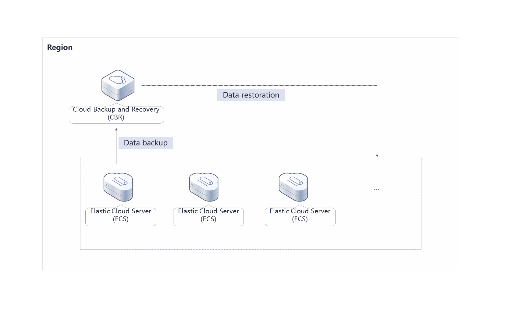
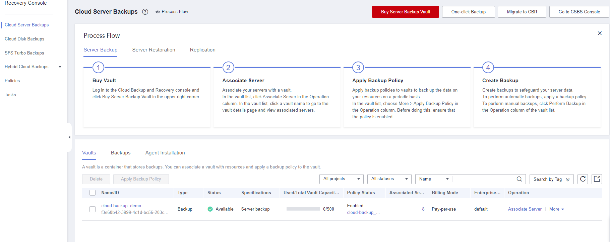
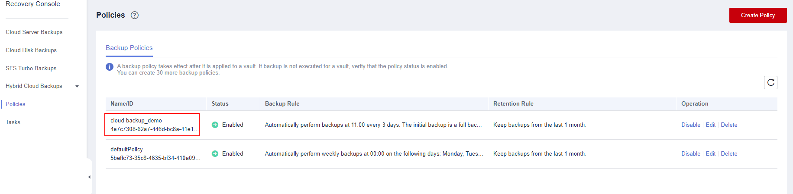

[TOC]

**Solution Overview**
===============
By using the Cloud Backup and Recovery (CBR) of Huawei Cloud and configuring an appropriate backup policy on CBR, this solution allows you to back up all unprotected Elastic Cloud Servers (ECSs) in a region securely and reliably. It protects your ECSs if any of the following incidents occur:

- Hacker or virus attacks
- Accidental deletions
- Application update errors

For more details about this solution, visit: https://www.huaweicloud.com/intl/en-us/solution/implementations/qbcs.html

**Architecture**
---------------


**Architecture Description**
---------------
With this solution, all ECSs within a region can be backed up in a few clicks:
- A server backup vault is created automatically to store ECS backups.
- ECSs that are not backed up are associated with the vault, and an appropriate backup policy is then applied to the vault.
- ECSs are automatically backed up and restored based on the applied backup policy to ensure that services run properly.

**File Structure**
---------------

``` lua
huaweicloud-solution-cloud-backup
├── cloud-backup.tf.json -- Resource orchestration template
```
**Getting Started**
---------------
1. Log in to the [CBR](https://console-intl.huaweicloud.com/console/?region=ap-southeast-3&agencyId=WOmAijZnbElNjCFzTVDl4aJQAgdaTUMD&locale=en-us#/cbr/manager/csbs/vaultList) console and view the resource created for cloud server backups.

	Figure 1 Cloud Server Backups
	

2. View the created backup policy.

	Figure 2 Backup policy
	

